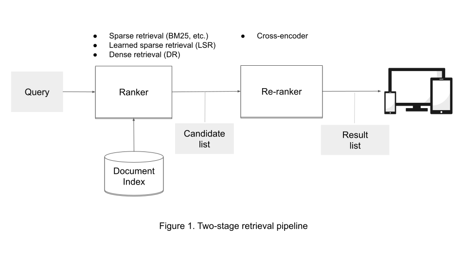

# Neural Information Retrieval

## Introduction
**Ad hoc retrieval** is the task of identifying documents relevant to a (usually new) query. **Neural Information Retrieval** (NIR) methods accomplish this using deep learning.

All the methods considered in this project are designed for content-based retrieval. That means that the relevance of the documents/passages is ranked based on their content with respect to a given query, as opposed to considering other types of signals such as page rank, user clicks, etc. Queries are typically short and may only contain keywords, while documents/passages are longer and contain more detailed information that may cover different topics. Moreover, documents relevant to a query may match semantically without containing many exact matches with query terms. Bridging the lexical gap between queries and documents is a long-standing challenge for lexical-based methods that rely on exact matches, such as BM25. However, recent advancements in neural methods, aided by modern representation learning techniques like pre-trained transformers, have brought significant improvements over prior methods, such as [query expansion using pseudo-relevance feedback](https://en.wikipedia.org/wiki/Relevance_feedback).

Retrieval methods typically need to handle large document collections containing millions or even billions of documents -- or even the entire public Internet in the case of web search. To ensure low retrieval latency, the retrieval process is typically split into multiple stages. Figure 1 shows a typical pipeline of a modern information retrieval system, which includes two stages: ranking and re-ranking. At the ranking stage, an efficient retrieval system (such as BM25, Dense Retrieval, or Learned Sparse Retrieval) is used to retrieve a set of document candidates, which are then re-ranked by a more expensive but more accurate system (such as Cross-Encoder) in the re-ranking stage.



In this project, we will delve into more advanced neural ranking and re-ranking systems, including:

<ul>
    <li>Cross-Encoder for re-ranking</li>
    <li>Dense Bi-Encoder for ranking</li>
    <li>(Learned) Sparse Bi-Encoder for ranking</li>
</ul>

### Objectives

<ol>
    <li>Setting up a modern deep learning pipeline for training and evaluation</li>
    <li>Implementing state-of-the-art neural information retrieval models</li>
    <li>Indexing and efficiently searching documents using vector indexing and inverted indexing methods</li>
</ol>

### Directory structure

📦neural_ir\
 ┣ 📂dataset\
 ┃ ┣ 📜__init__.py\
 ┃ ┣ 📜pair_collator.py\
 ┃ ┣ 📜pair_dataset.py :pencil2:\
 ┃ ┣ 📜triplet_collator.py\
 ┃ ┗ 📜triplet_dataset.py :pencil2:\
 ┣ 📂index\
 ┃ ┣ 📜__init__.py\
 ┃ ┗ 📜vector_index.py\
 ┣ 📂models\
 ┃ ┣ 📜__init__.py\
 ┃ ┣ 📜cross_encoder.py :pencil2:\
 ┃ ┣ 📜dense_encoder.py :pencil2:\
 ┃ ┗ 📜sparse_encoder.py :pencil2:\
 ┣ 📂public_tests\
 ┣ 📂trainer\
 ┃ ┣ 📜__init__.py\
 ┃ ┗ 📜hf_trainer.py\
 ┣ 📂utils\
 ┃ ┣ 📜__init__.py\
 ┃ ┗ 📜dataset_utils.py :pencil2:\
 ┣ 📜rank_dense.py\
 ┣ 📜rank_sparse.py\
 ┣ 📜rerank.py\
 ┗ 📜train.py


The `neural_ir` package is comprised of several sub-packages and modules that are crucial to its functionality. In the following, we'll provide an overview of these components:

- `neural_ir.dataset`: This package contains modules for loading, preprocessing, sampling, and batching datasets for training and inference. The datasets come in two forms: (1) triplet datasets, which consist of (query, positive document, negative document) triplets and are used for training with contrastive loss and (2) pair datasets, which consist of (query, document) pairs and are used for inference.

- `neural_ir.models`: This package contains the implementation of various neural IR models. Each model implementation includes two important methods, `score_pairs()` and `forward()`. The `score_pairs()` method calculates the relevance score of a batch of (query, document) pairs, while the `forward()` method takes in the sampled training triplets and returns the estimated loss for training.

- `neural_ir.trainer`: This component connects all the other components (dataset, collator, model, loss, optimizer) and handles common training routines, such as logging, evaluation, model selection, and checkpoint saving. This project uses a customized version of the HuggingFace trainer.

- `neural_ir.train`: This is the entry point for training and can be run by typing `python -m neural_ir.train` in the command line.

- `neural_ir.rerank`, `neural_ir.rank_dense`, `neural_ir.rank_sparse`: These modules handle different modes of inference, including re-ranking run files with a cross-encoder, vector indexing and searching with a dense bi-encoder, and inverted indexing and searching with a sparse bi-encoder. Each of these modules will generate a run file, which you need to save and commit for grading.

### Installing necessary packages

To install necessary packages for this project. Please run the following command in your terminal:
```console
pip install -r requirements.txt
```

### Section 1. Training a Cross-Encoder
#### To train
```console
python -m neural_ir.train ce
```
The best model's checkpoint will be save at `output/ce/model`.
In Python, you can load and use this model's checkpoint as follows:

```python
from neural_ir.models import CrossEncoder
from transformers import AutoTokenizer
tokenizer = AutoTokenizer.pretrained("output/ce/model")
ce = CrossEncoder.from_pretrained("output/ce/model")
pairs = [["This is a query","This is a document"]]
pairs = tokenizer(pairs, padding=True, truncation=True, return_tensors="pt")
scores = ce.score_pairs(pairs)
```

#### To predict and generate a run file
```console
python -m neural_ir.rerank
```
This command will re-rank the candidates generated by BM25 (found in `data/test_bm25.trec`). The re-ranked run file will be saved in `output/ce/test_run.trec`.

### Section 2. Training a Dense Bi-Encoder
#### To train
```console
python -m neural_ir.train dense
```
The best model's checkpoint will be save at `output/dense/model`.
In Python, you can load and use this model's checkpoint as follows:
```python
from neural_ir.models import DenseBiEncoder
from transformers import AutoTokenizer
tokenizer = AutoTokenizer.pretrained("output/dense/model")
dense_model = CrossEncoder.from_pretrained("output/dense/model")
queries = ["queries 1", "queries 2"]
docs = ["docs1", "docs2"]
queries = tokenizer(queries, padding=True, truncation=True, return_tensors="pt")
docs = tokenizer(docs, padding=True, truncation=True, return_tensors="pt")
scores = dense_model.score_pairs(queries, docs)
```
#### To predict and generate a run file
```console
python -m neural_ir.rank_dense
```

This command encodes all documents and test queries into dense vectors and utilizes the [Faiss](https://github.com/facebookresearch/faiss) library for indexing and searching in vector space. The resulting run file will be written to `output/dense/test_run.trec`. 

### Section 3. Training a Sparse Bi-Encoder
#### To train
```console
python -m neural_ir.train sparse
```
The best model's checkpoint will be save at `output/sparse/model`.
In Python, you can load and use this model's checkpoint as follows:
```python
from neural_ir.models import SparseBiEncoder
from transformers import AutoTokenizer
tokenizer = AutoTokenizer.pretrained("output/sparse/model")
sparse_model = CrossEncoder.from_pretrained("output/sparse/model")
queries = ["queries 1", "queries 2"]
docs = ["docs1", "docs2"]
queries = tokenizer(queries, padding=True, truncation=True, return_tensors="pt")
docs = tokenizer(docs, padding=True, truncation=True, return_tensors="pt")
scores = sparse_model.score_pairs(queries, docs)
```
#### To predict and generate a run file
```console
python -m neural_ir.rank_sparse
```

This command encodes textual documents and queries into sparse vectors (bag-of-words) and stores these vectors at `output/sparse/docs` and `output/sparse/queries`. Once these files are ready, the [pyserini](https://github.com/castorini/pyserini) library is used for inverted indexing and search. The resulting run file for test queries will be written to `output/sparse/test_run.trec`.

### HuggingFace API
In this project, we use the :hugs: Transformers library to load and train our neural models. This library is a powerful tool for natural language processing (NLP) and is widely used in the industry. If needed, you can find an extensive documentation [here](https://huggingface.co/transformers/).

The main components that we will be interacting with are the [Tokenizer](https://huggingface.co/transformers/main_classes/tokenizer.html) class and the [Model](https://huggingface.co/transformers/main_classes/model.html) class. The former is used to tokenize a text into a sequence of token ids, while the latter encodes a sequence of such token ids into a sequence of embeddings.

The following code snippet shows how to use these two classes to encode a query and a few documents into a sequence of embeddings. Note that we use the `distilbert-base-uncased` model and tokenizer for this example, but you can use any other model and tokenizer that you want:
```python
from transformers import AutoTokenizer, AutoModel

tokenizer = AutoTokenizer.from_pretrained("distilbert-base-uncased")
model = AutoModel.from_pretrained("distilbert-base-uncased")

query = "This is a query"
docs = [
    "This is a document",
    "This is another document",
    "This is yet another document",
]

query = tokenizer(query, padding=True, truncation=True, return_tensors="pt")
docs = tokenizer(docs, padding=True, truncation=True, return_tensors="pt")

query_embeddings = model(**query).last_hidden_state
doc_embeddings = model(**docs).last_hidden_state
```

Behind the scenes, the tokenizer returns an object of type `BatchEncoding`, which is a dictionary containing the token ids and other information. For our example collection of documents, it looks like this:
```python
{
    'input_ids': [
        [101, 2023, 2003, 1037, 6254, 102, 0],
        [101, 2023, 2003, 2178, 6254, 102, 0],
        [101, 2023, 2003, 2664, 2178, 6254, 102]
    ],
    'attention_mask': [
        [1, 1, 1, 1, 1, 1, 0],
        [1, 1, 1, 1, 1, 1, 0],
        [1, 1, 1, 1, 1, 1, 1]
    ],
    ...
}
```
Other than the `input_ids`, notice the `attention_mask` key which is used to indicate which tokens are "real" and which are "padding" tokens. The model expects this mask as input, and uses it to ignore the padding tokens when computing the embeddings.

Subsequently, the model takes these parameters as input (the `**` operator is used to "unpack" the dictionary and pass the values as keyword arguments) and performs a forward pass. The final output contains the desired embeddings of the input sequences, and looks like this:
```python
{
    'last_hidden_state': [
        [
            [-0.1659, -0.1084, ...],
            [-0.5257, -0.4065, ...],
            ...
        ],
        [
            [-0.1647, -0.1342, ...],
            [-0.5539, -0.3975, ...],
            ...
        ],
        [
            [-0.1048, -0.1085, ...],
            [-0.3779, -0.2081, ...],
            ...
        ]
    ],
    ...
}
```
We can then use these embeddings to compute the similarity between the query and the documents. 
